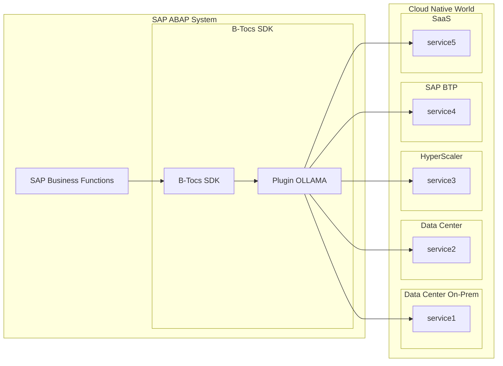
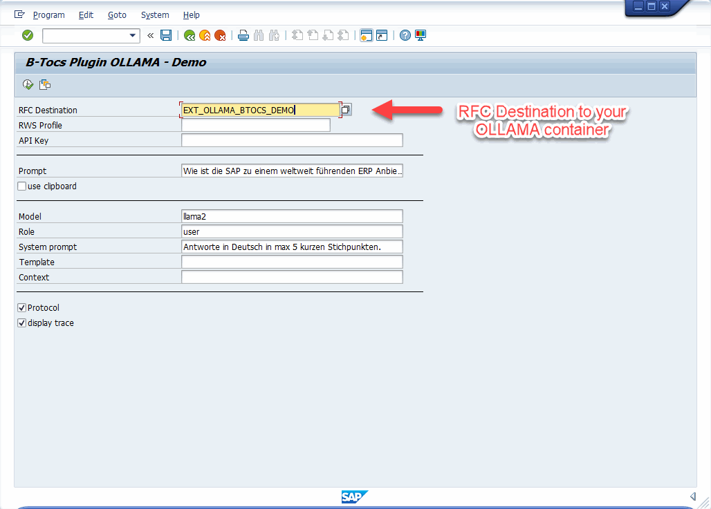
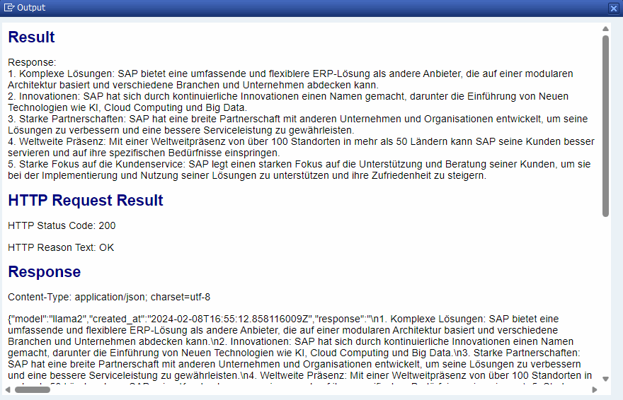
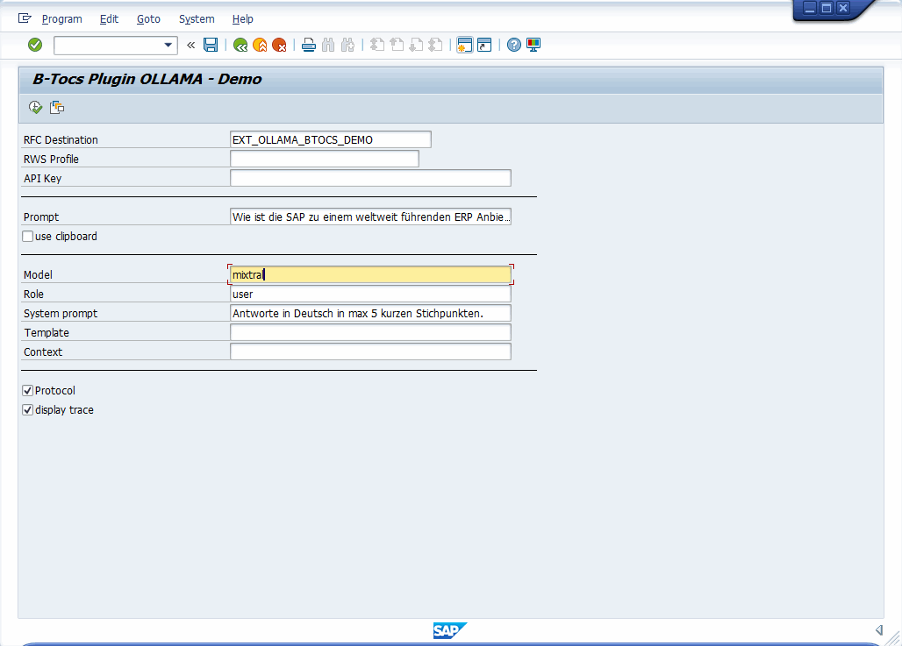
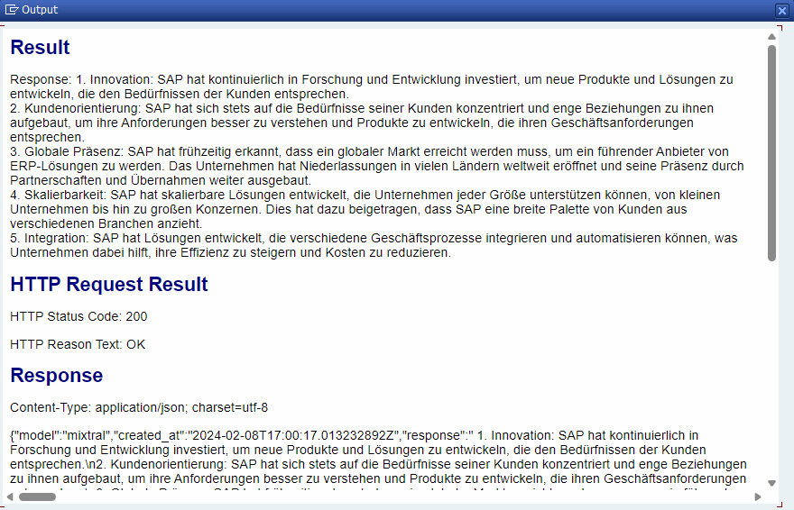
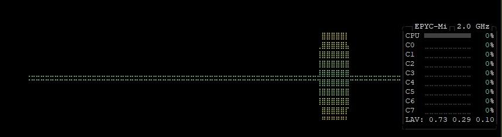

# B-Tocs ABAP Addon - OLLAMA Connector


## Summary

This plugin is based on the [B-Tocs ABAP SDK](https://github.com/b-tocs/abap_btocs_core) and enables the SAP ABAP Server to use Large Language Models provided by the [OLLAMA infrastructure services](https://ollama.ai). Most of the [Large Language Models](https://ollama.ai/library) can be tested from the ABAP server. For more information about the models and their licences see the [OLLAMA Library](https://ollama.ai/library) or the referenced [Hugging Face model page](https://huggingface.co/models).

The plugin is free at your own risk. 
MIT License.


## Architecture



## Screenshots

### LLAMA2 prompt



### LLAMA2 result



### MIXTRAL prompt



### MIXTRAL result



### Server Load




## Installation & Configuration

### 1. Prepare the AI backend

1. Configure the [OLLAMA docker container](https://hub.docker.com/r/ollama/ollama)
    1. locally with Docker Desktop - see [doc](doc/guides/local_install.md) 
    2. container stack within B-Tocs container farm - see [doc](doc/guides/btocs_farm.md)
    3. in an existing docker host or kubernetes cluster - install and configure the OLLAMA container as described [here](https://hub.docker.com/r/ollama/ollama)
2. Load your required models, e.g. "llama2", "mistral", "mixtral", ...
3. Test the models from command line within the container
4. check webservice port 11434 is available


### 2. Prepare your SAP ABAP Backend

1. An installed [B-Tocs ABAP SDK](https://github.com/b-tocs/abap_btocs_core) is required. Check for Updates.
2. Install this plugin with [abapGit](https://abapgit.org).
3. Use Package ZBTOCS_OLLAMA or $BTOCS_OLLAMA (local only)
4. Configure SM59 RFC Destination to your service
5. Test the connection
6. Execute program ZBTOCS_OLLAMA_GUI_RWS_DEMO for a demo


### 3. Use the OLLAMA Connector

1. Try model 'llama2' with a simple prompt
2. Try the system prompt feature 
3. Try other models with same prompts


#### Example ABAP Code:
```abap
DATA lo_response TYPE REF TO zif_btocs_rws_response.
DATA(ls_result) = VALUE zbtocs_ollama_s_generate_res( ).
DATA(lo_connector) = zcl_btocs_ollama_connector=>create( ).

IF lo_connector->set_endpoint(
    iv_rfc     = p_rfc
    iv_profile = p_prf
  ) EQ abap_true.

    lo_response = lo_connector->api_generate(
      EXPORTING
        is_params = VALUE zbtocs_ollama_s_generate_par(
          model       = 'llama2'
          role        = 'user'
          prompt      = 'Wie ist SAP zu einem Weltmarktführer für ERP Systeme geworden?'
          sys_prompt  = 'Antworte in Deutsch und in max. 5 Stichpunkten.'
          template    = ||
          context     = ||
        )
        iv_parse = abap_true
      IMPORTING
        es_result = ls_result
    ).

    IF ls_result IS NOT INITIAL.
      cl_demo_output=>write_text( text = |Response: { ls_result-response }| ).
      cl_demo_output=>display( ).
    ENDIF.
ENDIF.

lo_connector->destroy( ).

```
Check report ZBTOCS_OLLAMA_GUI_RWS_DEMO for more.


## Known Issues
1. Some Ollama API features are not implemented yet
2. The performance of the webservice depends on your AI backend. In local environment the performance is bad...
3. There is currently no data center experience for optimal conditions for the container and parallel requests
4. Known issues with backward compatibility. Will be fixed soon...

## FAQ

### I want to use it as a SAP customer
This plugin is free to use at your own risk (MIT licence).

### I want to use it as a SAP partner
It is free for you too. But sharing of ideas and code is expected: Contribute code, docs, ideas, ... to the project via pull requests, blogs, ...

### I need support
Support for individual issues is not available. Ask a good developer, partner or the community.

## I want to contribute
Fork this repository and contribute through pull requests. More extensive participation in this repository is possible after positive experiences.